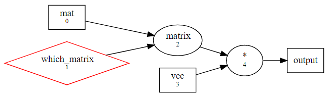

# tuneit: tune, benchmark and crosscheck

[](https://pypi.org/project/tuneit/)
[](https://pypi.org/project/tuneit/)
[](https://github.com/Lyncs-API/tuneit/blob/master/LICENSE)
[](https://github.com/Lyncs-API/tuneit/actions)
[](https://codecov.io/gh/Lyncs-API/tuneit)
[](http://pylint.pycqa.org/)
[](https://github.com/ambv/black)

Tuneit is a generic purpose tool for optimizing and crosschecking calculations.
Its usage is simple and with few changes one can turn few lines of Python code
into a tunable and dynamical calculation.

## Installation

The package can be installed via `pip`:

```
pip install [--user] tuneit
```

## Documentation

The Tuneit documentation can be accessed using the link: 
[tuneit documentation](https://tuneit.readthedocs.io/en/latest/)

The Tuneit package works with computational graphs, which have two main phases:

- A construction phase, where the graph is being built. Every operation that needs to be performed will be added to the graph as node along with all the variables and data input and output. Each type of node is visualised differently in the graph:
   
    * **Variables:** they are represented using diamonds. The outline is red in case the variable does not have a value yet and green in  case the variable has been assigned a fixed value.
    * **Operations:** they are represented using oval shapes.
    * **Data:** All data objects are represented using rectangles. Most of them represent data inputs, except for the last node in the graph, which represents the data output. 

- A finalization phase. After the graph is finalized, a number of operations can be performed on it:

    * **Visualize:** Using the `visualize()` function the graph can be visualized as it is shown above.
    * **Compute:** By simply calling the finalized object of the graph, the value final of the graph is computed and returned. 
    * **Crosshcheck:** The `crosscheck()` function will iterate through all the different options for a variable and return `True` 
      only for the ones that return the correct result of the graph. 
    * **Benchmark:** By using the `benchmark()` function, the computation times of all the different combinations of options for the 
      variables can be compared. In addition, by using the attribute `record` of the function, all those times can be recorded in a  
      dataframe. Furthermore, the `record` option allows for comparisons between not only the execution times that result by the various 
      alternatives for the variables, but also different inputs.
    * **Optimize:** By using the `optimize()` function, the variables of the graph can be tuned. Each time it is called, it returns the values that were used for the variables in that trial and the resulting computation time along with the best trial executed so far. 
      A trial consists of the timing of an execution of the graph using a different combination of values for the variables that are tuned. 


## Example

This section contains a small example that shows the construction of a graph for the multiplication of a matrix and a vector.

More details about this example can be found in the [example page](https://tuneit.readthedocs.io/en/latest/example.html) of the tuneit documentation.

````````````
@alternatives( 
    coo = lambda mat: sp.coo_matrix(mat),
    csc = lambda mat: sp.csc_matrix(mat),
    csr = lambda mat: sp.csr_matrix(mat),
    bsr = lambda mat: sp.bsr_matrix(mat)
)
def matrix(mat):
    return s.matrix(mat.todense())
    
mat=data(info=["shape","dtype"])
vec=data(info=["shape","dtype"])
mat=matrix(mat)
mul=mat*vec
mul=finalize(mul)

mul.visualize()
```````````````
The result of the `visualize()` function:


```````````````
matrix_value = sp.random(100,100,0.1)
vector_value = np.random.rand(100,1)

# for the result of the graph:
out = mul(mat=matrix_value, vec=vector_value) 

# for comparing the options of the variable which_matrix:
mul.benchmark(mat=matrix_value,vec=vector_value)
```````````````
The result of the `benchmark()` function:

| which_matrix     | Time           |
| :--------------: | :------------: |
| coo              | 475.300 usec   |
| csc              | 1.076 msec     |
| csr              | 1.478 msec     |
| bsr              | 845.800 usec   |
| matrix           | 803.200 usec   |

<br/>

## Acknowledgments

### Authors
- Simone Bacchio (sbacchio)
- Raphaella Demetriou (raphdem)

### Fundings
- PRACE-6IP, Grant agreement ID: 823767, Project name: LyNcs.