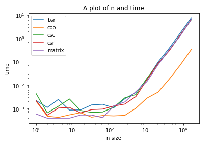

Example: A small tuning example using sparse matrices
=====================================================

:code:`tuneit` is imported as shown below along with some other packages that are used in this example:

.. code-block:: python

   from tuneit import *
   import scipy.sparse as sp
   import numpy as np

Firstly, a simple graph is constructed, which computes the multiplication of a sparse matrix with a vector. 
The graph contains one variable to be tuned, which represents the different formats that can be used for the sparse matrix.
The following function creates the sparse matrix and by using :code:`alternatives` more options are added for the format that will 
be used to express the matrix (available in the :code:`scipy.sparse` package).

.. code-block:: python

   @alternatives(
       var_name='which_sparse',
       coo = lambda matrix: sp.coo_matrix(matrix),
       csc = lambda matrix: sp.csc_matrix(matrix),
       csr = lambda matrix: sp.csr_matrix(matrix)
   )
   def bsr(matrix): 
       return sp.bsr_matrix(matrix)

In this way, we have created a function :code:`bsr` that expresses the given sparse matrix in an appropriate format and a variable 
to be tuned. The range of the variable :code:`which_sparse` contains all different options that can be used to express the sparse matrix, which are included in the function above (:code:`coo,csc,csr,bsr`). 

The graph takes as input the matrix and the vector to be multiplied. One option is to create a matrix and a vector at random:

.. code-block:: python

   mat=scipy.sparse.random(100,100,0.1)
   vec=np.random.rand(100)

Or just create two generic data objects, which will take their actual value later on: (this is the option used in this example)

.. code-block:: python

   mat=data(info=["shape","dtype"])
   vec=data(info=["shape","dtype"])
  
:code:`data()` creates a generic data object as no specific value is passed in the function. Even though no value is passed, some information 
about the new data object can be given using :code:`info`. As shown above, some characteristics about the new objects are given by the 
attributes :code:`shape` and :code:`dtype`. 

In addition, the :code:`bsr` function constructed previously can now be used. The new :code:`mat` object created after 
:code:`bsr` is called on the object :code:`mat` (created above) is a tunable object.

.. code-block:: python

   mat=bsr(mat)

The final graph :code:`mul` that expresses the multiplication between the vector :code:`vec` and the sparse matrix :code:`mat` is created 
as shown below:

.. code-block:: python

   mul=finalize(mat*vec)

.. 
   Do I need more explanations about the finalize function here and why it is needed?
   
Furthermore, we define a random sparse matrix and a random vector that will be used later on when actual values are needed to be passed for the :code:`mat,vec` objects created above.

.. code-block:: python

    matrix = sp.random(100,100,0.1)
    vector = np.random.rand(100)

Visualize
---------

The graph can now be visualized using:

.. code-block:: python

   visualize(mul)

The result is shown below:

.. image:: images/visualised_graph1.png

The data objects are shown in rectangles, the functions to be computed are presented in oval shapes, while the variables that have not taken a fixed value yet are shown in red diamonds. 

Note: Each node in the graph is represented by its name (such as :code:`bsr`) concatenated with a random sequence of characters, which
is not shown in its visualisation (for instance :code:`bsr-2b53519cefa68a68788760b169fee0b4`). 
The small indices included in the nodes of the visualised graph allow the user to distinguish between multiple operations of the same kind 
(e.g. multiplications) and to find out the whole unique name of a node in case it is needed in an operation:

For instance the following code should return the whole name of the node that contains the index 2 in the visualization of the graph :code:`mul`: 

.. code-block:: python

   mul.graph[2]

Crosscheck 
----------

The function :code:`crosscheck` can be called on the finalised object :code:`mul` as shown below. The function returns a callable sampler 
object.  

.. code-block:: python

   obj = crosscheck(mul)

If it is then called using real values (since the input :code:`mat,vec` of the graph was created using generic data objects) the sampler object
will iterate through all the possible alternative options for the variable of the graph (:code:`which_sparse`) and return :code:`True` only for the ones 
that produce the correct result of the graph. The :code:`crosscheck` function is basically a way to check that all alternatives options return 
the correct result.

.. code-block:: python

   obj(mat=matrix,vec=vector)

The result of the above operation is:

.. table::

    ==============  ========
    which_sparse    xcheck
    ==============  ========
    coo             True
    csc             True
    csr             True
    bsr             True
    ==============  ========

Benchmark 
---------

The function :code:`benchmark` can be called on the finalised object :code:`mul` as shown below. The function returns a callable sampler 
object.  

.. code-block:: python

   obj = benchmark(mul)

If it is then called using real values (since the input :code:`mat,vec` of the graph was created using generic data objects) the sampler object
will iterate through all the possible alternative options for the variable of the graph (:code:`which_sparse`) and time the execution of graph using each
option. The :code:`benchmark` function is basically a way to compare the execution times of all alternatives options of the variable.

.. code-block:: python

   obj(mat=matrix,vec=vector)

The result of the above operation is:

.. table::

    ==============  ============
    which_sparse    Time
    ==============  ============
    coo             448.800 usec
    csc             663.900 usec
    csr             1.796 msec
    bsr             1.551 msec
    ==============  ============

The :code:`bechmark` function has also an argument called :code:`record`, which if it set to :code:`True` allows the execution times of the graph
using alternative options for the variable to be stored in a :code:`panda` dataframe. In addition, now there is the option of also comparing
the execution times that result not only by the various alternatives for the variable, but also different inputs. For example, in the code below
different sizes of inputs are passed in each execution of the sampler. As a result, the returned dataframe :code:`trials` will contain the execution
time of the graph for all combinations of alternative options of the variable and different sizes of inputs.

.. code-block:: python

   obj = benchmark(mul, record=True) 
   for n in for [2**exponent for exponent in range(15)]:
       obj(mat=sp.random(n,n,0.1),vec=np.random.rand(n)).run()
   
The dataframe can be accessed as shown below:

.. code-block:: python   

   obj.trials
   
The produced dataframe looks like this:

.. table::

    ==========  ==============  ==============  ============  ============  ============  ==========
      trial_id  which_sparse    mat_shape       mat_dtype     vec_shape     vec_dtype          time
    ==========  ==============  ==============  ============  ============  ============  ==========
             0  coo             (1, 1)          float64       (1,)          float64       0.0004373
             1  csc             (1, 1)          float64       (1,)          float64       0.0003272
             2  csr             (1, 1)          float64       (1,)          float64       0.0004419
             3  bsr             (1, 1)          float64       (1,)          float64       0.0004452
             4  coo             (2, 2)          float64       (2,)          float64       0.0002657
           ...  ...             ...             ...           ...           ...           ...
            55  bsr             (8192, 8192)    float64       (8192,)       float64       0.882976
            56  coo             (16384, 16384)  float64       (16384,)      float64       0.18082
            57  csc             (16384, 16384)  float64       (16384,)      float64       3.64082
            58  csr             (16384, 16384)  float64       (16384,)      float64       3.59247
            59  bsr             (16384, 16384)  float64       (16384,)      float64       4.25281
    ==========  ==============  ==============  ============  ============  ============  ==========

The dataframe can be then used to compare different sizes of inputs for the different alternatives for the variable. One way to do this visually
is producing a graph like it is shown below:

Optimize:
---------

For the purposes of this example, we would like to tune the variable :code:`which_sparse` based only on the computation time of the multiplication 
(i.e. excluding the time taken by the function :code:`bsr` to construct the matrix). In order to achieve this, a link has to be added 
between the multiplication and :code:`which_sparse`, as they are not currently directly connected (:code:`which_sparse` is added as a dependency to the last node 
of the graph):

.. code-block:: python

   mul.add_deps('which_sparse')

The new link can be observed by running the code:

.. code-block:: python

   visualize(mul)

.. image:: images/visualised_graph2.png

In addition, the :code:`bsr` node in the graph needs to be marked as one to be precomputed so that its computation time is not 
taken into account when the execution of the graph is timed during the tuning of the variable. 
Note: In the following operation we can use the name :code:`bsr` for the node only because it is unique in the graph. If there were 
multiple operations of the same kind (e.g. the function :code:`bsr` is used twice in the graph), then the full name of the node would 
have to be used.

.. code-block:: python

   mul['bsr'].precompute=True 

.. 
   should I include a visualisation of the node marked as precomputed?

The only thing left to do is to actually tune the variable by calling the following functions:

.. code-block:: python

   obj = optimise(mul,sampler='optuna')

A tuner object has been created by passing the graph to be tuned along with the sampler to be used to the :code:`optimise()` function. 
The :code:`optuna` package is one of the options that are offered by :code:`tuneit` to be used as a sampler.

.. 
   maybe include a reference for the optuna package?

Now, the tuner object can simply be called, while also passing actual values for the sparse matrix and the vector. This is necessary, because 
during the tuning of the variable the computation of the graph will be carried out for the first time. Each time the tuner object is 
called, the tuner executes one more trial and it returns the value that was used for the variable in that trial and the resulting computation 
time along with the best trial executed so far. 
Note: A trial is a single execution of the objective function (which in this case is the timing of an execution) using a different combination
of values for the variables that are tuned. 

For example:

.. code-block:: python

   obj(mat=matrix,vec=vector)

.. 
   do I need to include a picture of the result here? (what the tuner returns after it is called a few times)
